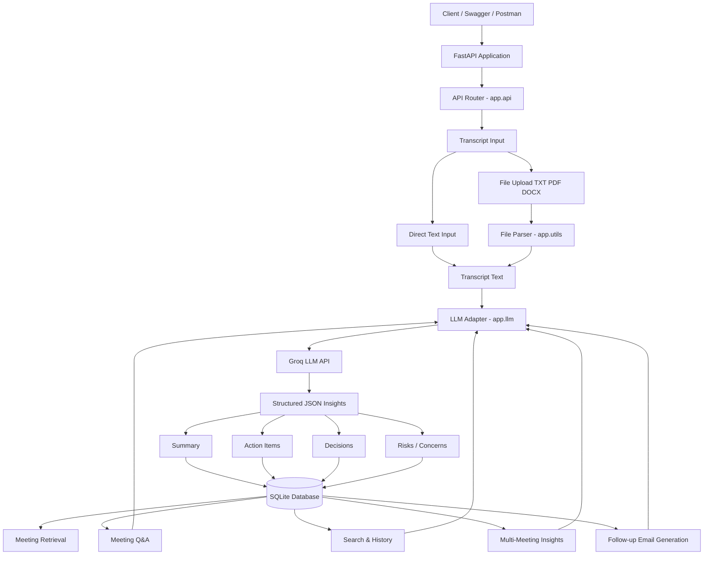

# Architecture Overview

## 1. Objective

The AI Meeting Assistant is a FastAPI-based backend service that analyzes meeting transcripts and extracts structured insights such as summaries, action items, decisions, risks, and concerns. It also supports meeting Q&A, meeting history search, follow-up email generation, and multi-meeting consolidated insights.

---

## 2. High-Level Architecture



---

## 3. Components

### 3.1 FastAPI Application

Files:

* `main.py`
* `app/api.py`

Responsibilities:

* Starts the FastAPI application.
* Registers API routes.
* Provides Swagger/OpenAPI documentation.
* Handles HTTP requests and responses.
* Performs request validation.
* Handles API-level errors.

Main endpoints:

* `POST /meetings/analyze`
* `POST /meetings/upload`
* `GET /meetings`
* `GET /meetings/{meeting_id}`
* `POST /meetings/ask`
* `POST /meetings/search`
* `POST /meetings/followup-email`
* `POST /meetings/multi-meeting-insights`
* `GET /meetings/action-items/pending/all`
* `PATCH /meetings/action-items/{action_item_id}`
* `DELETE /meetings/{meeting_id}`

---

### 3.2 LLM Adapter

File:

* `app/llm.py`

Responsibilities:

* Connects to the Groq API.
* Reads model configuration from `.env`.
* Sends prompts to the LLM.
* Enforces structured JSON output.
* Parses and validates LLM responses.
* Handles invalid or empty LLM responses.

LLM workflows:

* Meeting analysis
* Meeting Q&A
* Follow-up email generation
* Multi-meeting insight generation

Environment variables:

```env
GROQ_API_KEY=your_groq_api_key_here
GROQ_MODEL=llama-3.3-70b-versatile
```

---

### 3.3 Storage Layer

Files:

* `app/db.py`
* `app/models.py`

Technology:

* SQLite
* SQLModel

Responsibilities:

* Creates database connection.
* Creates database tables.
* Stores analyzed meeting information.
* Retrieves previous meetings.
* Stores normalized meeting insights.

Database tables:

* `Meeting`
* `ActionItem`
* `Decision`
* `Risk`
* `TranscriptChunk`

Storage design:

```text
Meeting
 ├── Summary
 ├── Transcript
 ├── ActionItems
 ├── Decisions
 ├── Risks
 └── TranscriptChunks
```

---

### 3.4 File Parsing Utility

File:

* `app/utils.py`

Responsibilities:

* Reads uploaded transcript files.
* Supports `.txt`, `.pdf`, and `.docx`.
* Converts uploaded files into plain transcript text.
* Splits transcript text into chunks for future retrieval and search.

Supported formats:

* TXT
* PDF
* DOCX

---

### 3.5 Schemas and Validation

File:

* `app/schemas.py`

Responsibilities:

* Defines request and response models.
* Validates required fields.
* Keeps API contracts clean and documented in Swagger.

Important schemas:

* `AnalyzeRequest`
* `QARequest`
* `SearchRequest`
* `FollowupRequest`
* `MultiMeetingInsightRequest`
* `UpdateActionItemRequest`

---

## 4. Request Flow

### 4.1 Direct Transcript Analysis

```text
Client
  -> POST /meetings/analyze
  -> FastAPI validates request
  -> app.llm analyzes transcript
  -> LLM returns structured JSON
  -> API stores summary, actions, decisions, risks
  -> API returns saved meeting insights
```

---

### 4.2 File Upload Analysis

```text
Client uploads .txt/.pdf/.docx
  -> POST /meetings/upload
  -> app.utils extracts transcript text
  -> app.llm analyzes transcript
  -> API stores structured insights
  -> API returns analyzed meeting data
```

---

### 4.3 Meeting Q&A

```text
Client asks question
  -> POST /meetings/ask
  -> API retrieves meeting context from database
  -> app.llm answers using stored meeting data
  -> API returns structured answer
```

---

### 4.4 Meeting Search

```text
Client submits search query
  -> POST /meetings/search
  -> API finds matching meetings using expanded keywords
  -> Matched meeting context is sent to LLM
  -> LLM generates answer from matched meetings
  -> API returns answer and matching meeting results
```

---

### 4.5 Multi-Meeting Insights

```text
Client asks for cross-meeting insight
  -> POST /meetings/multi-meeting-insights
  -> API retrieves selected or recent meetings
  -> app.llm consolidates decisions, risks, actions, and next steps
  -> API returns structured multi-meeting insights
```

---

## 5. Prompt Engineering Strategy

The LLM prompts are designed to return strict JSON instead of free-form text.

Prompt rules:

* Return only valid JSON.
* Do not include markdown.
* Do not include explanations outside JSON.
* Use fixed output schemas.
* Do not invent missing owners, decisions, or risks.
* Use `Unassigned` when action item owner is unclear.
* Mark action items as pending by default.

This improves API reliability and makes responses easier to store and consume.

---

## 6. Error Handling

The application handles:

* Empty transcript input
* Unsupported file formats
* Empty uploaded files
* Missing meeting records
* Invalid action item IDs
* LLM API failures
* Empty LLM responses
* Invalid JSON returned by LLM
* Database operation failures

Examples:

```text
400 Bad Request
- Empty transcript
- Unsupported file type
- Missing query/question

404 Not Found
- Meeting not found
- Action item not found

502 Bad Gateway
- LLM response parsing failed
- LLM returned invalid JSON

500 Internal Server Error
- Unexpected server/database error
```

---

## 7. Retrieval and Memory Strategy

The application stores meeting information in structured database tables.

Current retrieval approach:

* Meeting context is retrieved from SQLModel tables.
* Action items, decisions, risks, and transcript chunks are linked by `meeting_id`.
* Search uses keyword expansion and stored meeting data.
* Q&A uses retrieved meeting context and LLM reasoning.
* Multi-meeting insights combine context from multiple previous meetings.

Future retrieval improvement:

* Generate embeddings for transcript chunks.
* Store embeddings in FAISS, ChromaDB, Qdrant, Pinecone, or Weaviate.
* Use semantic similarity search for better retrieval.
* Send only top relevant chunks to the LLM.

---

## 8. Scalability Considerations

For local development, SQLite is used.

For production, the system can be scaled by:

* Replacing SQLite with PostgreSQL.
* Adding vector search using FAISS, Qdrant, Pinecone, ChromaDB, or Weaviate.
* Processing large transcripts using background workers.
* Adding Celery or RQ for async LLM jobs.
* Adding pagination for meeting history.
* Adding authentication and authorization.
* Storing uploaded files in S3 or cloud storage.
* Adding logging, monitoring, and request tracing.
* Adding retry logic for LLM API failures.
* Caching repeated Q&A/search responses.

---

## 9. Module Responsibilities

```text
main.py
- Creates FastAPI app
- Registers routers
- Initializes database
- Enables Swagger/OpenAPI

app/api.py
- Defines API endpoints
- Handles request validation
- Coordinates LLM, database, and utility modules
- Returns structured API responses

app/llm.py
- Handles Groq LLM integration
- Builds prompts
- Parses JSON responses
- Provides analysis, Q&A, email, and multi-meeting workflows

app/db.py
- Configures database engine
- Creates database tables
- Provides database session dependency

app/models.py
- Defines SQLModel database tables

app/schemas.py
- Defines Pydantic request/response schemas

app/utils.py
- Reads uploaded files
- Extracts text from TXT/PDF/DOCX files
- Chunks transcript text
```

---

## 10. Assumptions

* Meeting transcripts are provided in English.
* Uploaded PDFs contain extractable text and are not scanned image-only PDFs.
* Each action item may or may not have an explicit owner.
* If owner is missing, it is stored as `Unassigned`.
* Action items are treated as pending by default.
* SQLite is sufficient for local/demo usage.
* Groq API is used as the LLM provider.
* The API returns JSON responses suitable for frontend or external integration.
* Vector search is planned as a scalable improvement but not mandatory for the initial version.

---

## 11. Summary

The system follows a modular architecture with clear separation of concerns:

* FastAPI handles HTTP APIs.
* SQLModel handles persistence.
* Groq LLM handles AI reasoning.
* Utility functions handle file parsing.
* Structured schemas ensure clean API contracts.

This design is maintainable, testable, and extendable for production use with vector databases, PostgreSQL, background workers, and authentication.
